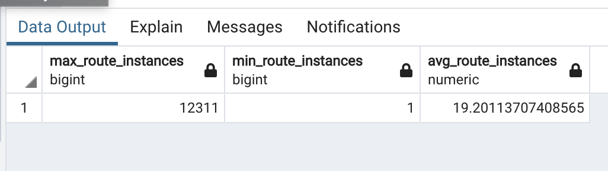
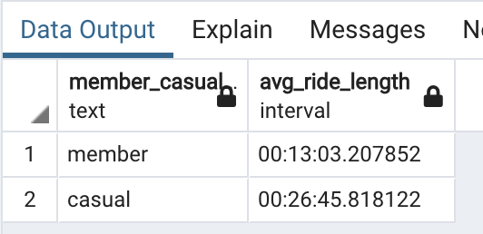
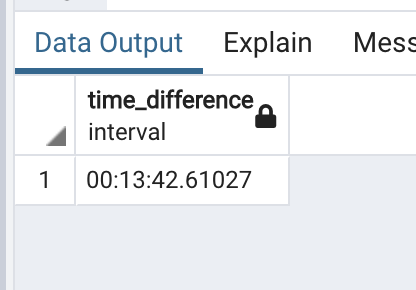
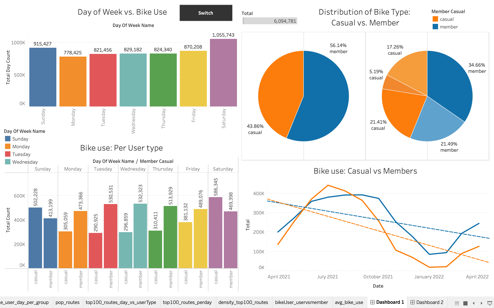
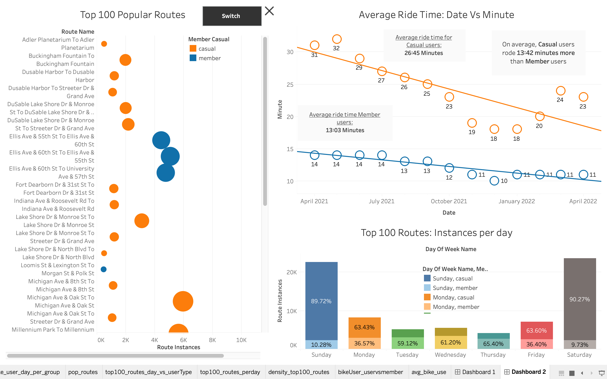

<h1 align = "center"> Case Study: Cyclistic Bike Share Company </h1>

 The data used in this project: <a href = "https://divvy-tripdata.s3.amazonaws.com/index.html">Here</a>

  
    
**Note:** 
- The project contains 13-months worth of company data; dates range from April 2021 to April 2022. 
- The datasets have a different name because Cyclistic is a fictional company. The data has been made available by Motivate International Inc. under this <a href = "https://divvy-tripdata.s3.amazonaws.com/index.html">license. </a>
- This is public data that you can use to explore how different customer types are using Cyclistic bikes.
    

---

## Introduction:
---
    
Cyclistic: A bike-share program that features more than 5,800 bicycles and 600 docking stations. Cyclistic sets itself apart by also offering reclining bikes, hand tricycles, and cargo bikes, making bike-share more inclusive to people with disabilities and riders who can’t use a standard two-wheeled bike. The majority of riders opt for traditional bikes; about 8% of riders use the assistive options. Cyclistic users are more likely to ride for leisure, but about 30% use them to commute to work each day.

    
## Goal:
---
    
Determine how annual members and casual riders differ, why casual riders would buy a membership, and how digital media could affect their marketing tactics. Identify trends in the historical bike trip data.

---    
### Tools Used
---

- SQL (PostgreSQL, pgadmin4):
- Python (Pandas, SQLAlchemy):
- Tableau(Data visualization):
 - Excel Spreadsheets:
    
### Table Attributes:

- RIDE_ID: Unique ride id; record of each bike ride 
- RIDEABLE_TYPE: The type of bike
- START_AT: The time the ride initiated 
- ENDED_AT: The time the ride finalized
- START_STATION_NAME: Name of the station that the ride initiated
- START_STARTION_ID: The ID associated with the start station.
- END_STATION_NAME: Name of the station that the ride finalized
- END_STARTION_ID: The ID associated with the end station
- START_LAT: The latitude coordinate where the ride started
- START_LNG: The longitude coordinate where the ride started
- END_LAT: The latitude coordinate where the ride ended
- END_LNG: The longitude coordinate where the ride ended
- MEMBER_CASUAL: The type of user; either membership or casual user.

---  
### Transforming Data and Cleaning Data
---

**Wrong data types**

- Date columns—STARTED_AT, ENDED_AT— came in as text datatypes after they were imported into the PostgreSQL database. I concatenated all the tables together, first, and then I changed the data type of the specified columns in the central table, to avoid doing the casting 13-separate times.

- Converted the data type of STARTED_AT and ENDED_AT columns into the appropriate types:

1) After the central table was established, created a new temporary column, in the scenario that casting doesn’t work, only the temp column is affected not the actual columns. 
2) Copy the data from the original column into the temp column, and cast the temp data type into the desired datatype—in our example: ‘TIMESAMP without time zone’
3) After reviewing and being satisfied with the temp column values and datatype, change the datatype and values of the original columns, utilizing the USING-clause and the temp column as reference.
4) Drop the temp column.

**Created new RIDE_LENGTH column**

- After converting our datatypes into the appropriate type, I created a new column called RIDE_LENGTH to calculate the length of the ride for each record.

**Created DAY_OF_WEEK_NAME column**

- Created the DAY_OF_WEEK_NAME column that holds the day that the ride took place; Sunday through Saturday, 0 to 6, respectively, using STARTED_AT.

#### Checking Data Integrity
---

**Unique records**

- Determine if there were duplicate records, I used the unique id: RIDE_ID and wrote a SQL query for the central table; if there were records with the same RIDE_ID, this would indicate a duplicate entry.
- I found NO duplicate records using the query— to count the number of instances where the same RIDE_ID is more than one, meaning there are duplicates of that RIDE_ID.

**Correct Latitude and Longitude coordinates**

- (Correct Latitude range: -90 to 90 degrees) (Correct Longitude range: -180 to 180 degree)
- Created a query to determine if any records contained invalid latitude or longitude coordinates in range. 
- Found NO invalid entries.

**Invalid categorical values**

- Using attribute MEMBER_CASUAL, if there were values not within the accepted range, casual or member, I would not use these records when grouping our data. 

---
### Analysis
---

#### Aggregate Data

-	Found the MAX ride length time for routes, per user type.
-	Found the MIN ride length time for routes, per user type
-	Found the AVG ride length time for routes, per user type
-	Found the AVG ride length for casual and membership user.
-	Found the TIME DIFFERENCE of the average ride time between the two user types, member and casual. 
-	Found the AVG ride length, per user type, for each month of the dataset—13 months total.
-	Found the total amount of unique routes

 

  
   

#### Analysis Queries

-	Calculated the total rides, per user type, by each month.
-	Calculated the total rides, per user type then type of bikes, MEMBER_CASUAL and RIDEABLE_TYPE, respectively.
-	Top 33 Popular Routes: Found the top 33 popular routes and grouped by the day of the week and user type, DAY_OF_WEEK_NAME and MEMBER_CASUAL, respectively.

---
### Findings
---

-	It’s evident, that members users overtake casual users in the number of instances that they used Cyclistic Bikes, 56.14% and 43.86%, respectively. April 2021 and April 2022, 13 months.
-	Classic bikes were the most popular among all bike types—classic, docked, and electric— in both user types. 
-	The most popular days of the week were the weekends, Saturday and Sunday. During these two days, casual users were dominant over member users in bike usage.
-	When looking at the top 33 popular routes, casual users were, once again, prevalent when it came to bike use. For example, casual users had 12,311 rides for their most popular route. Contrarily, member users’ most popular traveled route totaled 5,087.
-	Similarly, when looking at the top 33 popular routes, grouped by the day of the week, casual users were omnipresent in the distribution of the day of the week against the total rides. 
-	Lastly, when analyzing the average ride time for each user type, categorized by each month, casual users average 26:45 minutes of ride time. Conversely, the member users averaged 13:03 minutes of ride time. The time difference was 13:42 minutes; casual users rode, on average, longer than member users.

#### Data-Driven Decision

-	Marketing to casual users to convert them to member users will yield growth.
-	Focus on marketing efforts for weekends and the top 33 popular routes; in both points, casual users are omnipotent in the total bike rides
-	Additionally, casual users, on average, use bikes for a longer time compared to membership users. So, we can use this difference to leverage the monetary savings casual users can make; if they were to switch over to a membership type.

    
    
    
    
    
    
    
    
    
    
    
    
    
    
    
    
    
    
    
    
    
    
    
    
